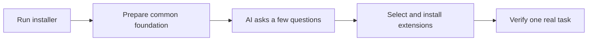

# Research AI Workbench

**Install the common foundation first. Let your AI ask a few questions, then add the tools your research needs.** You do not need to know which skills to choose.

The installer prepares a project, two general research skills, an isolated PDF-reading runtime, and a resumable installation record. Your existing AI then interprets your needs and selects extensions. No additional model API subscription is required by the installer.

## Start

1. Download this repository with **Code → Download ZIP** and extract it. While the repository is private, only authorized GitHub users can download it. Keep the extracted folder until setup finishes.
2. Open a terminal in the extracted folder and run one command:

   **macOS / Linux**
   ```bash
   bash install.sh
   ```

   **Windows PowerShell**
   ```powershell
   .\install.ps1
   ```

   The default destination is `ResearchWorkbench` in your home directory. Add `--workspace "path/to/my-project"` to choose another directory. Use the normal operating-system policy; if it blocks execution, see [troubleshooting](docs/TROUBLESHOOTING.md).
3. Open the resulting workspace in Codex or your existing local agent and say:

   > Read START_HERE.md and personalize my research workbench. Ask only what you still need to know. Select and install suitable extensions, then verify one real task. Use my preferred language.

The AI asks about your next output, research methods and existing tools, and relevant constraints. It reuses information already provided. If your direction is unclear, the common foundation stays usable and specialist installation is deferred.



Already working with an AI that can operate your computer? Give it [SETUP.md](SETUP.md). It can run the same process for you. That file also works as a standalone guide when the distribution cannot be obtained; standalone use is agent-driven, not an embedded installer.

## What is automatic

| Stage | Actual behavior |
| --- | --- |
| Common foundation | Create project folders; preserve existing rules; install original onboarding and reading skills; create an isolated runtime; install PDF reading; run a small functional check |
| Missing Python | Launchers reuse a suitable Python or obtain a local runtime through a checksum-verified, fixed Astral uv installer; no global Python replacement or shell profile edits |
| Personalization | Your existing AI understands the answers and selects catalog extensions; there is no hidden model call or keyword-based claim of intelligent diagnosis |
| Extensions | Install selected skill files at recorded revisions and their configured runtime packages; isolate runtimes by profile and verify supported calculations |
| Resume | Reuse matching files, check existing runtimes, retain failure records, and preserve different same-name skills |
| Final acceptance | The AI checks host discovery, any extra workflow-specific dependencies, and the user's chosen task; files installed are not treated as a completed research workflow |

Initial extensions cover literature, writing, symbolic mathematics, units/uncertainty, MATLAB guidance, data analysis, and scientific figures. The agent can evaluate other needs through the guide. MATLAB itself, commercial licenses, institutional access, external accounts, and the AI application are not bundled.

The installer downloads public software and skill files. It does not upload research materials or request credentials. Optional literature search sends the search query to the chosen provider. Login and paid choices remain with the user.

## Inspect or resume

With a working Python 3.11+:

```bash
python workbench.py plan
python workbench.py setup --workspace "path/to/my-project"
python workbench.py doctor --workspace "path/to/my-project"
```

The AI can prepare a local profile from [profile.example.json](profile.example.json), inspect it with `plan --profile <file>`, and install with `apply --profile <file>`. Empty extensions are valid. See [automation details](docs/AUTOMATION.md) for commands, states, and recovery.

## Status and documentation

Repository **0.2.0**, guide **1.4**. This is the first executable installer release. Check [compatibility and actual test coverage](docs/COMPATIBILITY.md) before assuming support on a particular computer. Windows and Linux runtime verification and independent user acceptance remain pending.

| Need | Entry point |
| --- | --- |
| Full agent workflow | [SETUP.md](SETUP.md) |
| Automatic installation boundaries and recovery | [Automation](docs/AUTOMATION.md) |
| Candidate skills, versions, and licenses | [Skills](SKILLS.md), [machine catalog](registry.json) |
| Failure or interrupted setup | [Troubleshooting](docs/TROUBLESHOOTING.md) |
| Source-grounded reading example | [Example](examples/README.md) |
| Personal configuration | [Rules template](templates/project-instructions.md), [configuration template](templates/workbench-config.md) |
| Development and tests | [Contributing](CONTRIBUTING.md) |

## Language and license

Canonical instructions and templates are in English. Conversation follows each user's language; manuscripts follow submission requirements. Clear wording, consistent terms, and evidence matter more than language alone. ASD-STE100 principles are used as guidance, not a compliance claim.

Original code, skills, instructions, and templates use the [MIT license](LICENSE). Downloaded third-party material keeps its own terms; see [NOTICE.md](NOTICE.md). No third-party skill source or paper PDF is bundled in the repository.
